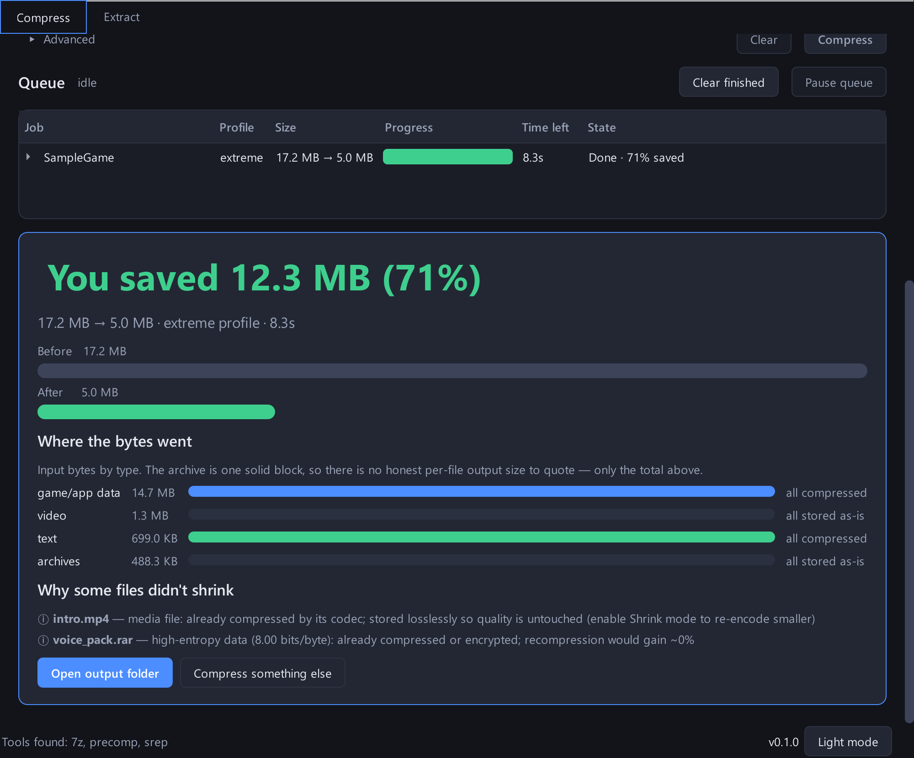
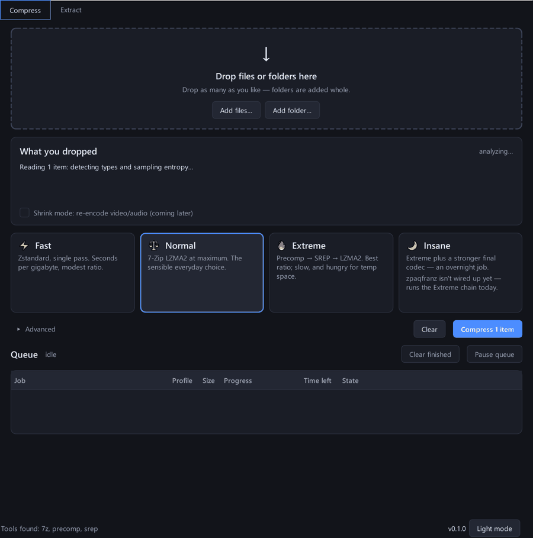
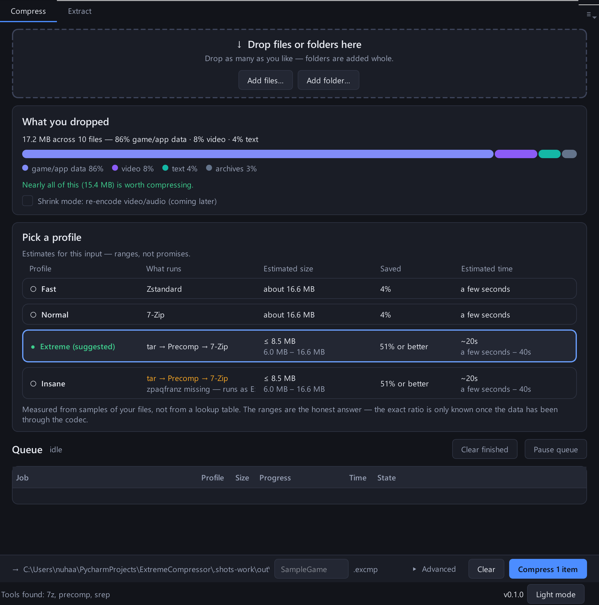
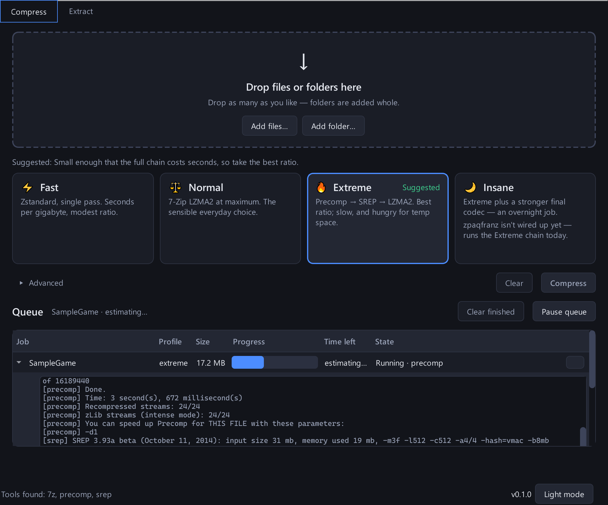

# 🗜️ ExtremeCompressor

> **FitGirl-repack-style extreme compression for your own files — games, documents, media — with honest handling of what can and cannot shrink.**


Most archivers run one algorithm over everything. ExtremeCompressor works like a
game repacker instead: it **analyzes every file**, **routes** it to the pipeline
that actually works for that data, chains **specialist tools** (precompression →
long-range dedup → strong codec), and **verifies** the restore is byte-identical
before ever claiming success.

<p align="center">
  
</p>

> **And it tells you the truth about the files it couldn't shrink.** No other
> compressor does — they just quietly return 0% and let you wonder.

---

## ✨ Features

- **Desktop app** — drop anything (files *and* folders, as many as you like),
  get an honest read on what can shrink before you commit, pick a preset from
  four cards that state their real cost, and watch an always-visible queue with
  live progress, per-job tool logs, pause and cancel.
- **Smart routing** — magic-byte type detection + Shannon-entropy sampling
  decides per file: pipeline it, or store it and *tell you why* (no more hours
  wasted "compressing" a video for 0%).
- **Repack-class pipeline** — `tar → Precomp (-intense) → SREP → 7-Zip LZMA2`:
  expands weak zlib layers hidden inside game paks, dedupes repeated assets,
  then compresses hard. **72% saved** on game-style data in first benchmarks.
- **4 profiles** — `fast` (zstd-19 long mode) · `normal` (7z max) · `extreme`
  (full chain) · `insane` (stronger final codec, WIP). Profiles degrade
  gracefully when a tool isn't installed.
- **Lossless media guarantee** — video/audio/images are stored bit-exact by
  default; quality is never touched. (Opt-in AV1/Opus "Shrink" mode is on the
  roadmap for when you *want* them smaller.)
- **Trust built in** — `.excmp` archives carry a manifest (exact stage chain,
  tool versions, SHA-256 of every file). Extraction replays the chain in
  reverse and fails loudly on any mismatch. Inputs are never modified; outputs
  are written atomically.
- **Progress, cancel, clean errors** — every stage streams progress; Ctrl-C
  safe; failures surface the tool's real output, not a stack trace.

---

## 🧬 How it works

```
 input files/folders
        │
        ▼
 ┌─────────────┐   magic bytes + entropy   ┌──────────────────────────────┐
 │  Analyzer    │ ─────────────────────────▶│  Router                      │
 └─────────────┘                            │  media / high-entropy → store │
                                            │  everything else → pipeline   │
                                            └──────────────┬───────────────┘
                                                           ▼
                    ┌──────────────────────────────────────────────────────┐
                    │  Stage chain (profile-dependent)                     │
                    │  tar → precomp → srep → 7z   (extreme)               │
                    └──────────────────────────┬───────────────────────────┘
                                               ▼
                        ┌───────────────────────────────────────┐
                        │  .excmp container                     │
                        │  manifest.json (chain + SHA-256 ledger)│
                        │  payload blob + stored/ files          │
                        └───────────────────────────────────────┘
```

| Component | Role |
|---|---|
| `excmp/analyzer.py` | File type detection (magic bytes, zlib-stream sniffing) + entropy sampling |
| `excmp/planner.py` | Profile → per-file route decisions with human-readable reasons |
| `excmp/stages/` | One module per tool: 7-Zip, zstd, tar, Precomp, SREP |
| `excmp/engine.py` | Runs the chain, packages, self-tests, atomic publish |
| `excmp/manifest.py` | `.excmp` container: schema-versioned manifest + payload |
| `excmp/verify.py` | SHA-256 ledger, restore verification |
| `excmp/cli.py` | `analyze` / `compress` / `extract` commands |

---

## 📊 First benchmark (2-core i7-3540M laptop, 17 MB mixed corpus)

| Profile | Compressed | Saved | Compress | Extract + verify |
|---|---|---|---|---|
| fast | 11.3 MB | 31.0% | 5.1s | 0.3s |
| normal | 11.2 MB | 31.2% | 2.5s | 0.5s |
| **extreme** | **4.5 MB** | **72.4%** | 8.5s | 1.6s |

The extreme win comes from Precomp opening zlib-wrapped "game pak" data and
SREP deduplicating shared assets **before** the final codec — order matters
more than strength. Full methodology in [`docs/benchmarks/`](docs/benchmarks/).

---

## 📁 Project structure

```
.
├── excmp/                  # engine package (knows nothing about the GUI)
│   ├── analyzer.py         # type detection + entropy
│   ├── planner.py          # profiles + routing
│   ├── engine.py           # orchestration, verify, atomic outputs
│   ├── manifest.py         # .excmp container
│   ├── verify.py           # SHA-256 ledgers
│   ├── cli.py              # command-line interface
│   └── stages/             # sevenzip, zstd, tar, precomp, srep
├── gui/                    # PySide6 desktop app (python -m gui)
│   ├── theme.py            # design tokens → QSS (dark + light)
│   ├── suggest.py          # analysis summary, honesty copy, preset advice
│   ├── progress.py         # per-stage progress → one job percentage + ETA
│   ├── queue_manager.py    # QueueManager + engine workers on a thread pool
│   ├── winintegration.py   # taskbar progress, toasts, tray (all optional)
│   ├── mainwindow.py       # the single-window flow
│   └── widgets/            # dropzone, analysis card, presets, queue, results
├── tests/                  # 90 pytest tests incl. real-tool roundtrips
├── tools/
│   ├── bench.py            # profile benchmark harness
│   └── shots.py            # regenerates docs/images/ from the real app
├── docs/
│   ├── images/             # README screenshots + demo GIF
│   ├── research/           # compression landscape research (7 docs)
│   ├── superpowers/specs/  # approved design document
│   ├── superpowers/plans/  # implementation plans
│   └── benchmarks/         # measured results
└── main.py                 # legacy Tkinter prototype (superseded)
```

---

## 🚀 Getting started

### 1. Clone and set up

```bash
git clone https://github.com/NuhaadhHasn/ExtremeCompressor.git
cd ExtremeCompressor
python -m venv .venv
.venv\Scripts\activate
pip install -r requirements.txt          # engine + GUI
pip install -r requirements-dev.txt      # plus pytest, pytest-qt, Pillow
```

Only `zstandard` is needed if you just want the CLI.

### 2. Install the tools

| Tool | Needed for | Get it |
|---|---|---|
| [7-Zip](https://www.7-zip.org/) | `normal` / `extreme` | installer puts `7z.exe` in `C:\Program Files\7-Zip` |
| [Precomp](https://github.com/schnaader/precomp-cpp) | `extreme` (optional) | detected at `C:\Program Files\precomp\` |
| SREP | `extreme` (optional) | detected at `C:\Program Files\srep\` |

Missing tools are fine — profiles degrade automatically and tell you what was skipped.

### 3. Use it

```bash
python -m gui
```

…or from the command line:

```bash
# what would happen? (categories, entropy, routing plan)
python -m excmp analyze "D:\MyGame"

# compress with the full repack chain
python -m excmp compress "D:\MyGame" -o game.excmp -p extreme

# restore — verified byte-identical, or it fails loudly
python -m excmp extract game.excmp -o "D:\restored"
```

Example output:

```
done: 16.3 MB -> 4.5 MB (72.4% saved) in 8.5s
note: 1 file(s) stored losslessly - media file: already compressed by its
      codec; stored losslessly so quality is untouched
```

### 4. Run the tests

```bash
python -m pytest tests -v
```

---

## 🖥️ The desktop app

```bash
python -m gui
```

<p align="center">
  
</p>

One window, no modal dialogs, in this order:

| Step | What it does |
|---|---|
| **Drop zone** | Files *and* folders, any number at once, appended to the queue. (HandBrake's two most-reported intake bugs, avoided by design.) |
| **Analysis card** | Runs the analyzer on a worker thread and reports the composition plus the honest gain estimate — *"Nearly all of this (15.4 MB) is worth compressing"* or *"86% of this is already compressed and will be stored bit-exact"*. |
| **Preset cards** | Fast / Normal / Extreme / Insane, each stating its real cost, with the suggested one pre-selected. Cards whose tools are missing say what will actually happen instead of degrading silently. |
| **Queue** | Always on screen. Name, profile, size→size, live progress, time left, state — and a per-job expander showing the tool's own output. Pause finishes the current stage before holding; cancel kills the child process and leaves nothing behind. |
| **Results** | The big number, a to-scale before/after bar, input bytes by type, and one plain-English sentence per file that couldn't shrink. |
| **Extract tab** | Pick an `.excmp`, pick a destination, get the verified hash count back. |

<p align="center">
  
  
</p>

Also: taskbar progress, a completion toast with an "Open folder" button,
optional minimize-to-tray, a light theme, full keyboard tab order, accessible
names on every icon-only control, and no meaning carried by colour alone.

Every screenshot above is regenerated from the real app by
[`tools/shots.py`](tools/shots.py) — it builds a reproducible ~17 MB
repack-style corpus, drives the actual window through the whole flow, and
grabs the frames. The numbers in them are genuine output, not mockups.

The legacy Tkinter prototype in `main.py` still runs but is superseded.

---

## 🗺️ Roadmap

- [x] Research: repack tech, video encoding, archiver landscape (`docs/research/`)
- [x] Engine core: analyzer, router, stages, verified `.excmp` roundtrip, CLI
- [x] Extreme chain with real Precomp + SREP, first benchmarks
- [x] PySide6 GUI (drop zone, suggestions, queue, progress, results, extract)
- [ ] zpaqfranz backend → completes the `insane` profile
- [ ] Opt-in video/audio Shrink mode (FFmpeg + SVT-AV1, quality-targeted)
- [ ] Per-file-type specialists (PNG/JPEG/WAV recompression)
- [ ] PyInstaller packaging + SHA-pinned tool downloader

See [`docs/ROADMAP.md`](docs/ROADMAP.md) for the detailed step-by-step plan.

---

## ⚠️ Honest limitations

- **Already-compressed data (video, MP3, RAR…) cannot shrink losslessly** — no
  tool on earth does this; ExtremeCompressor stores it and says so. Re-encoding
  (lossy, quality-targeted) is the only way and will be strictly opt-in.
- `extreme` trades time and temp disk space (Precomp can inflate data 2-5×
  mid-pipeline) for ratio — that's the repack deal.
- SREP is closed freeware: used if installed, never bundled or redistributed.

---

## 🤝 Contributing

Issues and PRs welcome. Run the tests, keep the "inputs are never modified"
and "verify before success" guarantees intact.

## 📄 License

MIT for this codebase — see [LICENSE](LICENSE). External tools keep their own
licenses (7-Zip LGPL, Zstandard BSD, Precomp Apache-2.0, SREP freeware).
